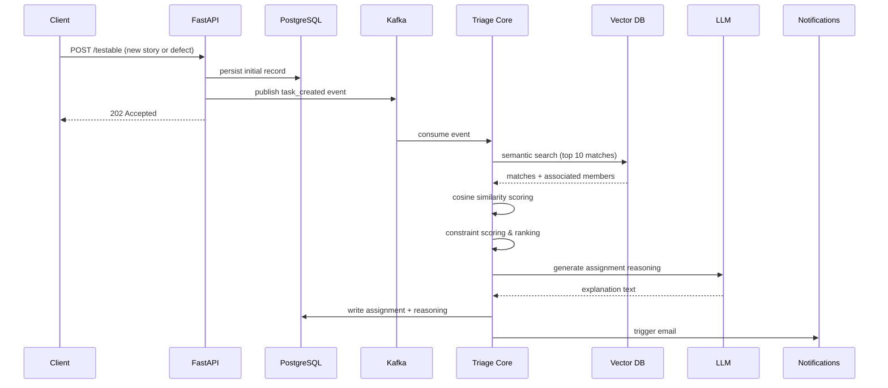

# System architecture

The core design constraint I set for myself was that the API should never block waiting on AI processing. A task comes in, it gets acknowledged quickly, and the heavy work happens asynchronously. That decision shaped most of what follows.

## Event-driven request flow

The API returns a `202 Accepted` almost immediately. The consumer handles everything else in the background. This also makes the system easier to reason about in failure scenarios — if the AI pipeline has a problem, it doesn't take down the API with it.

## Codebase components

### API (`triage.api`)

Built with FastAPI. The endpoints cover creating testable items, fetching current assignments, and managing team member records. Nothing in the API layer touches the AI pipeline directly — it only publishes events.

### Kafka consumer (`triage.core.kafka`)

This is the bridge between the API and the processing pipeline. When a `task_created` event lands in the topic, the consumer picks it up and kicks off the retrieval and scoring flow. Kafka also gives me replay capability if I need to reprocess events — useful during development when I was still iterating on the scoring logic.

### Services (`triage.services`)

Business logic lives here. The services layer handles things like checking whether a team member is available, validating assignment rules, and managing state transitions for testable items. It's what the API calls into, and what the consumer calls into — keeping those two entry points from duplicating logic.

### Repositories and models (`triage.repositories`, `triage.models`)

I went with the repository pattern to keep raw SQLAlchemy queries out of the service layer. Each entity type has its own repository class with typed methods, so the services don't need to know anything about how data is actually fetched or persisted. Schema changes are managed through Alembic migrations.

### Notifications (`triage.core.notifications`)

Once an assignment is finalized, this module fires off an email to the assigned engineer with the task details and the AI-generated reasoning. In development I route this through Mailpit so I can inspect the emails without needing real SMTP credentials or worrying about accidentally spamming anyone.
