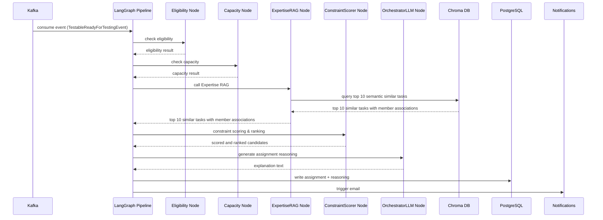

# Triage: Event-Driven AI Orchestrator for QA Task Routing

*Triage: the preliminary assessment of patients or casualties in order to determine the urgency of their need for treatment and the nature of treatment required.*

That's roughly the job this project does too. The moment a story or defect gets marked ready-for-testing (RFT), Triage runs it through a retrieval and scoring pipeline that weighs things like the ticket's content, each engineer's current load, and who's handled similar work before — then assigns it to whoever should pick it up, with a plain-English reason attached.

I built this in the gap between finishing my internship at ServiceNow, Hyderabad and starting full-time(which didn't go as planned ✌️), to get ahead of a problem that was about to become my daily headache.

## Background

ServiceNow, like a lot of companies, started feeling the shift that AI brought to software testing. Writing automated tests got dramatically simpler, which prompted the org to merge the dedicated QA Engineer role into a single "Software Engineer" title. Everyone was now expected to share testing responsibilities alongside their dev work.

Before this, the flow was straightforward. Developers would pick up stories and defects, work on them, and mark them "ready for testing." The 1-2 QA engineers on each team would then split those tasks between themselves and get to work. It wasn't glamorous, but it was unambiguous.

After the merger, that clarity vanished. Nobody knew who was supposed to test what. Every sprint, the same question came up. It became a manual coordination problem that fell entirely on the Scrum Master to resolve — who is testing this story? Who picked up that defect?

Our team had a convention: the newest joiner takes on the Scrum Master role. The reasoning from my manager was that it forces you to stay across everything the team is doing and interact with every member. It's a great onboarding mechanism, honestly. But it also meant that after my FTE conversion, this particular problem was going to land on me.

So I built Triage.

## How Triage solves it

Triage is an event-driven system that automatically routes QA tasks to the right engineer. When a testable item (story or defect) is created, it gets picked up by a Kafka consumer, run through a retrieval and scoring pipeline, and assigned to a team member — along with a plain-English explanation of why that person was chosen.

The name fits. Just as triage in medicine is about rapid, structured assessment to determine who gets what treatment, this system does the same for QA tasks: assess them quickly and route them to the right hands.



## Quickstart

```bash
# Spin up Kafka and Mailpit first
docker-compose up -d

# Apply DB migrations
uv run alembic upgrade head

# Start the API server
uv run uvicorn triage.main:app --reload
```

For a full breakdown of the setup, see [SETUP_AND_DEPLOYMENT.md](SETUP_AND_DEPLOYMENT.md).

## Documentation

- [Architecture and event flow](ARCHITECTURE.md)
- [How the AI engine works](AI_ENGINE.md)
- [Setup and deployment](SETUP_AND_DEPLOYMENT.md)